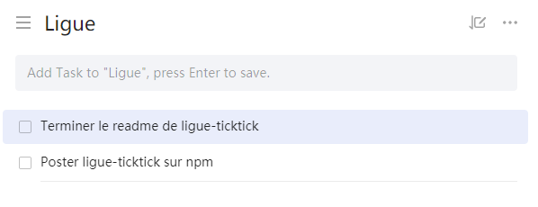

# Ligue-ticktick

Bienvenue sur le repository de Ligue-ticktick !

L'objectif est simple : proposer une application en ligne de commandes pour extraire les tâches de TickTick et générer un affichage pour les objectifs-updates du discord de [Ligue.dev](https://ligue.dev).

## Prérequis

- Node.js >= 10
- npm >= 5
- Un compte sur [TickTick](https://ticktick.com)
- Une liste de tâches comportant les objectifs du jour

## Installation

L'installation est très simple, il suffit d'effectuer une seule commande pour avoir accès à l'application depuis n'importe quel terminal.

```bash
npm install -g ligue-ticktick
```

## Configuration

### Identifiants

Pour récupérer les tâches de TickTick, il faut pouvoir s'y connecter. C'est pourquoi vous devez renseignez vos identifiants dans un fichier **.env**. Un fichier **.env.example** existe et il suffit de le remplir puis de le renommer en **.env**.

Par défaut, le fichier est localisé ici :

- Windows : %USERPROFILE%\AppData\Roaming\npm\node_modules\ligue-ticktick
- Unix : /usr/local/lib/node_modules/ligue-ticktick

Fichier **.env.example** par défaut :

```env
TICKTICK_USERNAME = "your_username"
TICKTICK_PASSWORD = "your_password"
DISCORD_TOKEN = "your_discord_token"
```

### Liste de tâches

Afin de distinguer les tâches du jour à poster sur la Ligue, il est nécessaire de posséder une Liste spécifique. Par défaut, le nom de la liste doit être Ligue mais il est possible de spécifier un autre nom via un argument.

<div align="center">
	
	<p>Setup nécessaire pour récupérer les tâches du jour<p>
</div>

## Utilisation
### get-goals
Pour récupérer les objectifs sur TickTick, rien de plus simple : une seule commande à taper dans le terminal. Il ne restera qu'à copier le contenu puis coller dans le salon #objectifs-updates ou ajouter le paramètre --discord pour que le contenu soit envoyé automatiquement.

Trois arguments existent :

- **--list** ou **-l** suivi du nom de la liste (Ligue par défaut)
- **--todo** ou **-t** suivi de l'emoji souhaité devant les objectifs (:construction: par défaut)
- **--discord** ou **-d**

Commande de base :

```bash
ligue-ticktick get-goals
```

Avec liste spécifique (dans cet exemple, **Work**) :

```bash
ligue-ticktick get-goals --list Work
```

Avec un emoji différent :

```bash
ligue-ticktick get-goals --todo :gear:
```

Pour envoyer un message sur Discord dans #objectifs-updates :

```bash
ligue-ticktick get-goals --discord
```

### get-report
Voir notre évolution est toujours agréable, c'est pourquoi une commande existe pour générer un rapport. Le rapport contient toutes les tâches terminées sur X jours, affiché dans la console.

Par défaut, le rapport est généré en prenant en compte les 31 derniers jours mais, l'option **--days <number>** permet de modifier cette valeur.

Bien évidemment, il est également possible de changer le nom de la liste, comme pour get-goals avec l'option **--list <name>**.

Exemple de commande pour générer un rapport sur 15 jours :
```bash
ligue-ticktick get-report --days 15
```
