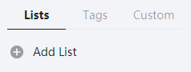

# Ligue-ticktick

Bienvenue sur le repository de Ligue-ticktick !

L'objectif est simple : proposer une application en ligne de commandes pour extraire les tâches de TickTick et générer un affichage pour les objectifs-updates du discord de [Ligue.dev](https://ligue.dev).

## Prérequis

- Node.js >= 10
- npm >= 5
- Un compte sur [TickTick](https://ticktick.com)
- Une liste de tâches comportant les objectifs du jour

## Installation

L'installation est très simple, il suffit d'effectuer une seule commande pour avoir accès à l'application depuis n'importe quel terminal.

```bash
npm install -g ligue-ticktick
```

## Configuration

### Identifiants

Pour récupérer les tâches de TickTick, il faut pouvoir s'y connecter. C'est pourquoi vous devez renseignez vos identifiants dans un fichier **.env**. Un fichier **.env.example** existe et il suffit de le remplir puis de le renommer en **.env**.

Par défaut, le fichier est localisé ici :

- Windows : %USERPROFILE%\AppData\Roaming\npm\node_modules
- Unix : /usr/local/lib/node_modules

Fichier **.env.example** par défaut :

```env
TICKTICK_USERNAME=your_username
TICKTICK_PASSWORD=your_password
```

### Liste de tâches

Afin de distinguer les tâches du jour à poster sur la Ligue, il est nécessaire de posséder une Liste spécifique. Par défaut, le nom de la liste doit être Ligue mais il est possible de spécifier un autre nom via un argument.

<div align="center">
	
	<p>Bouton pour ajouter une liste sur TickTick<p>
</div>
